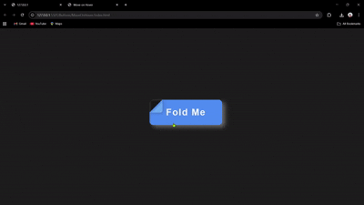

# Fold Hover Button Effect ✨

The fold is created using a `::before` pseudo-element, diagonal gradients, and smooth cubic-bezier motion for a realistic, physical feel.

## 🛠️ Built With
- HTML
- CSS (Pseudo-elements, Gradients, Transitions)

## 🎯 Purpose
Created as a UI micro-interaction experiment to explore:
- Depth & lighting using gradients  
- Realistic motion using cubic-bezier easing  
- Interactive button feedback
